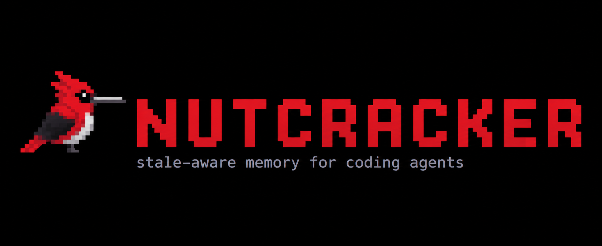
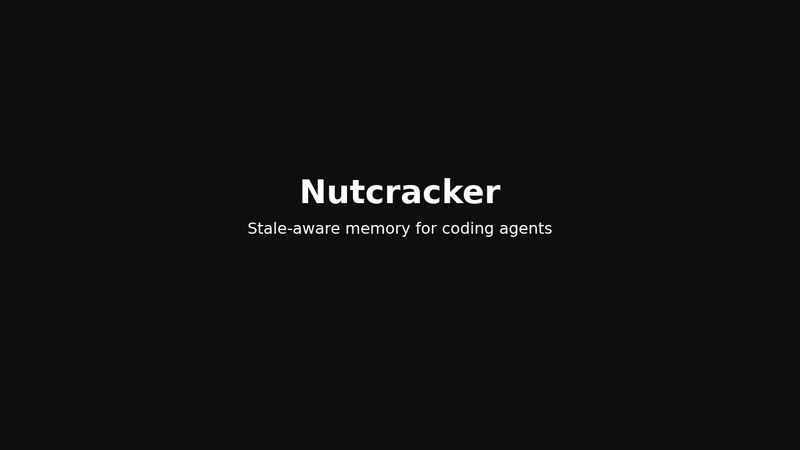

<p align="center">
  
</p>

<h1 align="center">Nutcracker</h1>

<p align="center">
  <strong>Stale-aware episodic memory for coding agents.</strong><br>
  Persistent project knowledge with a structural trust check before reuse.
</p>

<p align="center">
  <a href="https://github.com/Skeletus/nutcracker-memory/actions/workflows/tests.yml"></a>
  <a href="https://www.python.org/downloads/"></a>
  <a href="LICENSE"></a>
  <a href="pyproject.toml"></a>
</p>

Nutcracker gives coding agents persistent episodic memory that is revalidated
against the current codebase before it is reused. Semantic relevance helps the
agent find memories that may matter; file-level anchor revalidation tells it
whether the code context that supported a memory is still intact.

<p align="center">
  
</p>

<p align="center"><em>Remember → Recall → Code changes → Revalidate</em></p>

## Why Nutcracker?

Coding agents can retrieve an old project note because it is semantically
similar, even after the code behind that note has changed. Similarity answers
one question:

> Is this memory relevant?

Nutcracker asks a second question before treating it as trusted:

> Is the file context that supported this memory still intact?

That separation is the product. Nutcracker is a small MCP server and Python
CLI for durable project knowledge: architectural decisions, investigated bugs,
rejected approaches, and conventions that should survive a session boundary.

## The demo

The included demo shows a real three-act flow:

1. **Act 1 — remember:** Codex analyzes Flask and saves durable project
   knowledge with explicit file anchors.
2. **Act 2 — recall:** a new Codex session recalls the memory as
   `FOUND · integrity 100%`.
3. **Act 3 — revalidate:** an anchored Flask file changes, so the same memory
   becomes `FALLBACK_REQUIRED`.

The current MVP detects file drift, not semantic invalidation. A changed file
does not prove that the historical decision is wrong; it tells the agent to
re-check the current repository instead of blindly trusting stale context.

## How it works

When a durable memory is saved, Nutcracker stores:

- the episode: a concise summary and optional decision context;
- an embedding of the summary for semantic retrieval;
- one primary repository-relative file anchor and optional related files;
- a complete-file SHA-256 hash for every anchor at save time.

On recall, Nutcracker embeds the query, retrieves semantically relevant
episodes, and re-reads their anchored files. It computes equal-weight anchor
integrity:

```text
anchor_integrity = valid_anchors / total_anchors
score = semantic_similarity × anchor_integrity
```

It then returns one high-level state:

| State | Meaning |
| --- | --- |
| `FOUND` | A relevant memory has fully valid file anchors. |
| `FALLBACK_REQUIRED` | Relevant memories exist, but none is fully structurally valid. Re-check the repository. |
| `NO_MATCH` | No stored memory passes the semantic relevance filter. |

Recall evaluates current files without rewriting the historical episode or its
baseline hashes.

## Quick start

Install the CLI once, initialize it from the repository whose history you want
to remember, then start Codex:

```text
uv tool install git+https://github.com/Skeletus/nutcracker-memory.git
cd my-project
nutcracker init
nutcracker doctor
codex
```

`nutcracker init` creates `.nutcracker/memory.db`, adds `.nutcracker/` to
`.gitignore`, installs the Nutcracker policy in `AGENTS.md`, and configures the
MCP server for Codex. Codex CLI must already be installed and available on
`PATH`.

To switch the active repository later:

```text
cd another-project
nutcracker use
nutcracker doctor
codex
```

The current MVP supports **one active repository at a time**. `nutcracker use`
changes the repository used by the next Codex session; it does not retarget an
already open session. Simultaneous Codex sessions for different repositories
are not supported safely.

The first save or recall may take longer because FastEmbed lazily downloads the
configured `BAAI/bge-small-en-v1.5` model. Network access is needed only while
the model is absent from the local cache.

## CLI

| Command | Purpose |
| --- | --- |
| `nutcracker init` | Initialize this repository and activate its MCP configuration. |
| `nutcracker use` | Select an already initialized repository for the next Codex session. |
| `nutcracker doctor` | Check the repository, database, policy, and Codex MCP setup. |

## MCP experience

Nutcracker exposes two MCP tools: `memory_save` and `memory_recall`.
Human-readable results stay compact while structured results remain available
to the client:

```text
Nutcracker · Memory saved

Nutcracker · Memory recalled
FOUND · integrity 100%

Nutcracker · Memory may be stale
FALLBACK_REQUIRED · integrity 86%

Nutcracker · No relevant memory
NO_MATCH
```

The public `memory_save` contract uses explicit file paths relative to the
active repository:

```json
{
  "summary": "Flask keeps application and request context responsibilities separate.",
  "primary_path": "src/flask/ctx.py",
  "related_paths": ["src/flask/app.py", "src/flask/globals.py"],
  "type": "decision"
}
```

Anchors must be existing whole files. `primary_path` identifies the main
anchor; `related_paths` add supporting files.

## Architecture

```text
Codex
  ↓
MCP server: nutcracker
  ↓
memory_save / memory_recall
  ↓
semantic retrieval + file-anchor revalidation
  ↓
<repo>/.nutcracker/memory.db
```

The implementation is intentionally small: Python, SQLite, summary embeddings,
cosine similarity, and complete-file hash checks. See the
[implementation notes and research backlog](docs/README.md) for the detailed
status matrix, scoring policy, schema notes, and experiment ideas.

## Scientific inspiration

The name and research direction are inspired by spatial-memory findings
associated with Clark's nutcrackers: memories can be tied to environmental
landmarks, multiple cues can support retrieval, and context can matter when a
cue becomes unreliable.

Those findings motivate engineering questions; they do not specify a known
biological or computational algorithm. Nutcracker's current mechanisms—file
anchors, SHA-256 baselines, summary embeddings, equal-weight integrity, and
the three recall states—are engineering choices of this project, not a claimed
simulation of a bird's memory. The
[curated scientific basis](docs/nutcracker_scientific_memory_curated.md)
records the evidence and its caveats.

## Current scope: v0.1.0

The MVP deliberately has a narrow, inspectable scope:

- file-level anchors only; any byte change marks that anchor changed;
- no semantic understanding of whether a change invalidates a memory;
- no symbol-level AST anchors and no rename tracking;
- one active repository at a time, with no safe simultaneous multi-repo
  sessions;
- `AnchorLevel` and `AnchorRelation` exist internally but do not affect current
  retrieval or scoring;
- `FALLBACK_REQUIRED` is a signal to re-check the repository; Nutcracker does
  not repair code or automatically explore a fallback.

These are boundaries of the current MVP, not promises about future behavior.

## What this is not

Nutcracker is not:

- a full code-intelligence graph or a replacement for codebase indexing;
- a semantic code-diff engine or automatic contradiction detector;
- a production-scale vector database or a claim of production readiness;
- a faithful biological simulation or an implementation of a “Clark's
  nutcracker memory algorithm.”

Codebase intelligence tools help answer, “What does the current repository look
like?” Nutcracker addresses a complementary question: “What did we conclude
before, and how much should we trust that memory against the repository today?”

## Development

Clone the repository, install development dependencies, and run the test suite:

```text
uv sync --dev
uv run pytest -v
uv build
```

The GitHub Actions workflow runs the same test and build checks on pushes and
pull requests. The project is early-stage and its MVP hypothesis is still to
be evaluated: whether file-anchor revalidation reduces stale-memory use without
creating too many false warnings.

## Roadmap

Future experiments may explore symbol-level anchors, rename-resistant identity,
stability-aware anchor weighting, repository maps, structural-neighborhood
retrieval, and caller-driven fallback exploration. These are hypotheses, not
current capabilities. The [research backlog](docs/README.md) describes them
in more detail.

## License

Nutcracker is released under the [MIT License](LICENSE).
